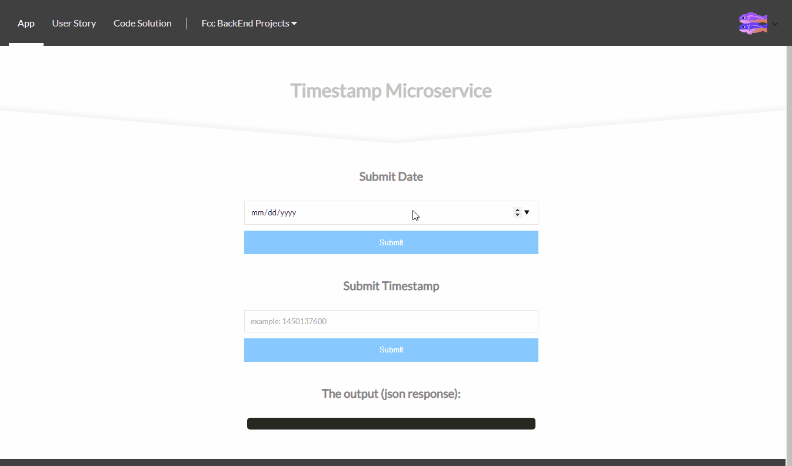

# API Project: Timestamp Microservice for FCC
### About the project

it's a freecodecamp project in the "Apis and Microservices Projects" module, you have to build an API that will return a json response containing 'unix' and 'utc' timestamp.

bonus*: 
- Front-end using React

### Tools used

**Front-end:** React

**Back-end:** Express

### Screenshot



### Link

https://fcc-bt-timestamp.glitch.me

### User stories

1. The API endpoint is ```GET [project_url]/api/timestamp/:date_string?```
2. A date string is valid if can be successfully parsed by ```new Date(date_string)``` (JS) . Note that the unix timestamp needs to be an **integer** (not a string) specifying **milliseconds**. In our test we will use date strings compliant with ISO-8601 (e.g. ```"2016-11-20"```) because this will ensure an UTC timestamp.
3. If the date string is **empty** it should be equivalent to trigger ```new Date()```, i.e. the service uses the current timestamp.
4. If the date string is **valid** the api returns a JSON having the structure 
```{"unix": <date.getTime()>, "utc" : <date.toUTCString()> }```
e.g. ```{"unix": 1479663089000 ,"utc": "Sun, 20 Nov 2016 17:31:29 GMT"}```.
5. If the date string is **invalid** the api returns a JSON having the structure ```{"unix": null, "utc" : "Invalid Date" }```. It is what you get from the date manipulation functions used above.